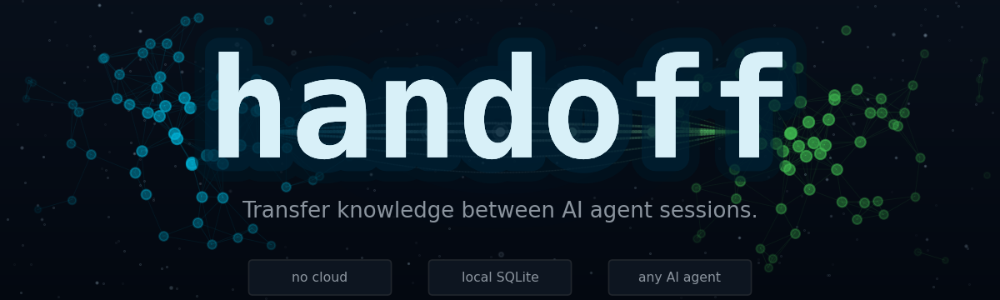
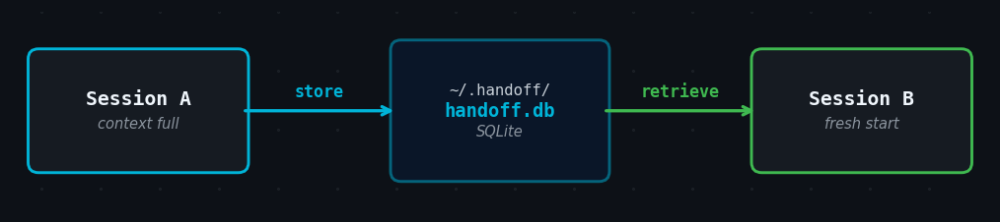

<p align="center">
  
</p>

<p align="center">
  <a href="https://github.com/Dborasik/handoff/releases"></a>
  <a href="https://go.dev"></a>
  <a href="https://img.shields.io/badge/platform-macOS%20%7C%20Linux%20%7C%20Windows-lightgrey"></a>
  <a href="LICENSE"></a>
  <a href="https://dborasik.github.io/handoff/"></a>
</p>

<p align="center">
  <strong>When an AI agent's context window fills up, accumulated project knowledge is lost.</strong><br>
  <code>handoff</code> lets agents <strong>store</strong> structured knowledge packages to a local SQLite database and <strong>retrieve</strong> them in the next session — no cloud, no config, no server.
</p>

<p align="center">
  
</p>

---

## Install

**Homebrew** (macOS / Linux):

```bash
brew tap Dborasik/tap
brew install handoff
```

**Go install** (all platforms, requires Go 1.26+):

```bash
go install github.com/Dborasik/handoff@latest
```

**Windows** — download the pre-built `.zip` from the [releases page](https://github.com/Dborasik/handoff/releases), extract it, and place `handoff.exe` in a directory on your `%PATH%`.

> Full installation instructions — including PATH setup, build from source, and pre-built binaries for all platforms — are in the **[Install guide →](https://dborasik.github.io/handoff/install/)**

---

## Quick Start

**Session A** — your context is filling up.

You say to the agent:
> *"Our context is getting large. Do a handoff."*

The agent composes a structured summary of the current project state, stores it, and replies:
> *"Done — stored as `a3f9c12e`. In the next session, say: 'retrieve handoff `a3f9c12e`' or 'retrieve the api-state package'."*

---

**Session B** — you start a fresh session with a new agent.

You say:
> *"Retrieve knowledge package `a3f9c12e`."*

The agent fetches the stored context and resumes exactly where you left off — no re-explaining the project, no lost decisions, no starting over.

> The agent handles the `handoff store` and `handoff retrieve` commands internally. See the **[Commands reference](https://dborasik.github.io/handoff/commands/)** for details on what it runs.

---

## Commands

| Command | Description |
|---------|-------------|
| `handoff store` | Read content from stdin and save it as a named knowledge package |
| `handoff retrieve` | Fetch a package by ID or name and write its content to stdout |
| `handoff list` | List all non-expired packages in a table |
| `handoff gc` | Manually delete all expired packages |
| `handoff completion` | Generate a shell completion script (bash, zsh, fish, PowerShell) |

All commands share a single SQLite database at `~/.handoff/handoff.db` (macOS/Linux) or `%USERPROFILE%\.handoff\handoff.db` (Windows), configurable via `HANDOFF_DB`.

> **[Full command reference →](https://dborasik.github.io/handoff/commands/)**

---

## Agent Setup

Drop one file into your project. The agent will automatically check for existing packages at the start of every session, offer proactive knowledge transfers when the context grows large, and respond to phrases like *"do a handoff"* or *"save context"*.

There are two options — always-on instruction files (loaded every session) and on-demand skill files (loaded only when relevant). See the **[Agent Setup guide](https://dborasik.github.io/handoff/agents/)** for a full comparison.

### Always-on instruction files

| Agent | File to create in your project | One-line install |
|-------|-------------------------------|-----------------|
| Claude Code | `CLAUDE.md` | `curl -fsSL https://raw.githubusercontent.com/Dborasik/handoff/main/instructions/CLAUDE.md -o CLAUDE.md` |
| GitHub Copilot | `.github/copilot-instructions.md` | `curl -fsSL https://raw.githubusercontent.com/Dborasik/handoff/main/instructions/copilot-instructions.md -o .github/copilot-instructions.md` |
| OpenAI Codex | `AGENTS.md` | `curl -fsSL https://raw.githubusercontent.com/Dborasik/handoff/main/instructions/AGENTS.md -o AGENTS.md` |
| Cursor | `.cursor/rules/handoff.mdc` | `curl -fsSL https://raw.githubusercontent.com/Dborasik/handoff/main/instructions/cursor.mdc -o .cursor/rules/handoff.mdc` |

### On-demand skill files

| File to create | Supported by |
|---------------|-------------|
| `.github/skills/handoff/SKILL.md` | GitHub Copilot |
| `.agents/skills/handoff/SKILL.md` | OpenAI Codex and other agents |
| `.claude/skills/handoff/SKILL.md` | Claude Code |

---

## Configuration

| Variable | Default (macOS/Linux) | Default (Windows) | Description |
|----------|-----------------------|-------------------|-------------|
| `HANDOFF_DB` | `~/.handoff/handoff.db` | `%USERPROFILE%\.handoff\handoff.db` | Path to the SQLite database file |

There is no config file. This is the only setting.

---

## Documentation

Full documentation is available at **[dborasik.github.io/handoff](https://dborasik.github.io/handoff/)**.

| Page | Contents |
|------|---------|
| [Install](https://dborasik.github.io/handoff/install/) | All install methods, PATH setup, pre-built binaries, uninstall |
| [Commands](https://dborasik.github.io/handoff/commands/) | Full reference for all five commands with flags, output, and error tables |
| [Agent Setup](https://dborasik.github.io/handoff/agents/) | Always-on vs skill file comparison, curl commands per agent |
| [Workflow](https://dborasik.github.io/handoff/workflow/) | The two-session handoff pattern and recommended package format |
| [How It Works](https://dborasik.github.io/handoff/internals/) | Database schema, ID generation, TTL, GC, design principles |

---

## License

MIT — see [LICENSE](LICENSE).
